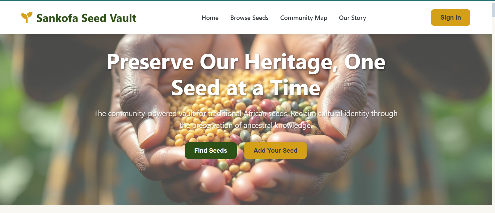

# Sankofa Seed Vault – Indigenous Seed Preservation Platform

Sankofa Seed Vault is a web-based platform designed to preserve, document, and share indigenous African seeds. It connects communities, seed keepers, and knowledge holders to protect Africa’s agricultural heritage and ensure food sovereignty for future generations.

## Live Demo

Visit Sankofa Seed Vault Website (https://sankofa-seed-vault.netlify.app/)  
View Project Presentation (https://lesbijouxdoran.my.canva.site/sankofa-seed-vault-pitch-deck-template)

## Screenshots

Home Page


Seed Browser


Community Map


Our story


*(Comming soon...!)
Seed Stories Page
Stories

Seed Submission Form
Seed Submission

Seed Keeper Directory
Directory

## Features

* Seed Browser: Search and explore indigenous seeds by region, type, and cultural name
* Seed Categories: Grains, Vegetables, Tubers, Fruits, Legumes
* Interactive Map: Shows community seed keepers across Africa
* Seed Stories: Audio narratives and QR-linked cultural histories
* Verification System: Seeds validated by trusted elders and seed keepers
* Responsive Design: Works across desktop and mobile
* Offline-First Concept: Optimized for regions with limited connectivity

## Technologies Used

**Frontend:** HTML5, CSS3, JavaScript
**Mapping:** Leaflet.js
**Icons:** Font Awesome
**QR Codes:** QRCode.js
**Data Storage:** Client-side (no backend)
**No External Dependencies:** All functionality runs in the browser

## Project Structure

```
Sankofa-Seed-Vault/
├── index.html            # Main application file
├── css/
│   └── style.css         # Stylesheet
│   └── img 
├── js/
│   └── main.js           # JavaScript logic
└── screenshots/          # Images used in README
```

## Setup Instructions

### 1. Clone or Download the Project

```
git clone <https://github.com/mercyngatia/Sankofa-Seed-Vault.git>
cd Sankofa-Seed-Vault
```

### 2. Run the Application

* Open `index.html` in a web browser
* No server required – works directly in the browser

### 3. Using the Platform

* Browse seeds by type or region
* View cultural notes and verification badges
* Explore the interactive community map
* Scan QR codes to access seed stories
* Navigate the Seed Keeper Directory to discover contributors

## Data Storage

Sankofa Seed Vault uses client-side storage and browser caching for:

* Seed listings
* Map markers
* Story references
* User interactions

No data is transmitted to any server. The platform is fully client-side.

## Browser Compatibility

This application works in all modern browsers that support:

* ES6 JavaScript
* CSS Flexbox and Grid
* Local or in-memory storage
* Leaflet.js rendering

## Customization

You can customize Sankofa Seed Vault by modifying:

* Colors and theme variables in `style.css`
* Seed categories and data in `main.js`
* Map settings in the Leaflet initialization
* Content and layout in `index.html`

## Future Enhancements

Possible future improvements:

* Database integration for real seed storage
* User accounts for Seed Keepers
* Seed image uploads
* Multilingual language support
* Community storytelling recordings
* Admin dashboard for seed verification
* Offline PWA functionality

## License

This project is open source.

---

Sankofa Seed Vault – Preserving Seeds, Preserving Identity

---
